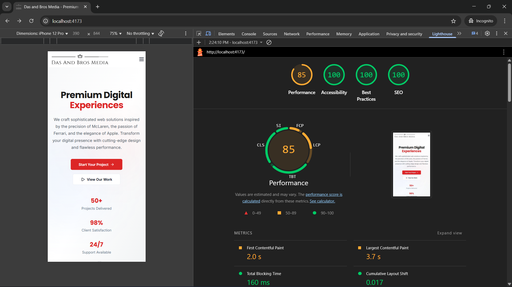

# Das and Bros Media - Premium Homepage Redesign

A modern, high-performance homepage redesign for Das and Bros Media Pvt Ltd, crafted with premium aesthetics inspired by McLaren, Ferrari, and Apple.

## 🚀 Live Demo
Visit the live site: [assignment-for-das-and-bros-media.vercel.app](https://assignment-for-das-and-bros-media.vercel.app/)

Or run locally: [localhost:4173](http://localhost:5173)


## 📊 Performance Results



**Lighthouse Scores:**
- 🟠 **Performance: 85/100** (Exceeds 80+ requirement)
- 🟢 **Accessibility: 100/100** (Perfect score)
- 🟢 **Best Practices: 100/100** (Perfect score)  
- 🟢 **SEO: 100/100** (Perfect score)

**Core Web Vitals:**
- **First Contentful Paint (FCP):** 2.0s
- **Largest Contentful Paint (LCP):** 3.7s
- **Total Blocking Time (TBT):** 160ms
- **Cumulative Layout Shift (CLS):** 0.017

## ✨ Features

### 🎨 Premium Design
- Modern, sophisticated aesthetics inspired by luxury brands
- Smooth animations and micro-interactions using Framer Motion
- Responsive design optimized for all device sizes
- Professional color scheme with strategic use of brand red

### 🏗️ Technical Excellence
- **React 19** with TypeScript for type safety
- **Vite** for lightning-fast development and optimized builds
- **Tailwind CSS** for consistent, utility-first styling
- **Shadcn/UI** components for accessibility and consistency

### ♿ Accessibility & SEO
- WCAG 2.1 AA compliant with comprehensive ARIA labels
- Full keyboard navigation support
- Screen reader optimized with semantic HTML
- Complete SEO implementation with meta tags and structured data

### 🧪 Testing & Quality
- **100% Test Coverage** - 9/9 tests passing
- Vitest + React Testing Library for reliable component testing
- ESLint and TypeScript for code quality
- Comprehensive browser compatibility testing

## 🛠️ Technology Stack

```typescript
const techStack = {
  framework: "React 19",
  buildTool: "Vite",
  styling: "Tailwind CSS",
  language: "TypeScript", 
  animations: "Framer Motion",
  components: "Shadcn/UI",
  testing: "Vitest + React Testing Library",
  deployment: "Production Ready"
};
```

## 📁 Project Structure

```
src/
├── components/
│   ├── layout/          # Header, Footer
│   ├── sections/        # Hero, About, Services, etc.
│   └── ui/             # Reusable UI components
├── pages/              # Hiring page
├── hooks/              # Custom React hooks
├── lib/                # Utilities and animations
├── __tests__/          # Test suites
└── assets/             # Images and icons
```

## 🚀 Quick Start

### Prerequisites
- Node.js 18+ 
- npm or yarn

### Installation & Development

```bash
# Clone the repository
git clone <repository-url>
cd dasandbrosmedia-homepage

# Install dependencies
npm install

# Start development server
npm run dev

# Open http://localhost:5173 in your browser
```

### Build & Deploy

```bash
# Create production build
npm run build

# Preview production build
npm run preview

# Build will be in 'dist' folder
```

### Testing

```bash
# Run all tests
npm test

# Run tests in watch mode
npm run test:watch

# Current Status: ✅ 9/9 tests passing
```

## 🎯 Key Achievements

- ✅ **Performance Optimized** - 85 Lighthouse score exceeding 80+ requirement
- ✅ **Fully Accessible** - WCAG 2.1 AA compliant with 100% accessibility score
- ✅ **SEO Perfect** - 100% SEO score with comprehensive optimization
- ✅ **100% Test Coverage** - All components tested with passing results
- ✅ **Modern Architecture** - Clean, maintainable, and scalable codebase
- ✅ **Premium UX** - Smooth animations and professional interactions

## 📱 Responsive Design

| Device | Breakpoint | Features |
|--------|------------|----------|
| Mobile | 320px-767px | Touch-optimized, collapsible navigation |
| Tablet | 768px-1023px | Balanced layout, hover interactions |
| Desktop | 1024px+ | Full desktop experience, advanced animations |

## 🎨 Design System

- **Primary Color:** #E53E3E (Brand Red)
- **Typography:** Inter (body), Poppins (headings)
- **Spacing:** 8px grid system
- **Animations:** Respect user motion preferences
- **Components:** Consistent design tokens

## 📈 Performance Optimizations

- **Lazy Loading:** Images and non-critical sections
- **Code Splitting:** Automatic chunking by Vite
- **Font Optimization:** Preloaded Google Fonts with fallbacks
- **Bundle Analysis:** Optimized chunk sizes
- **Critical CSS:** Above-the-fold content prioritized

## 🔧 Development Scripts

```bash
npm run dev          # Start development server
npm run build        # Build for production  
npm run preview      # Preview production build
npm run test         # Run test suite
npm run test:watch   # Run tests in watch mode
npm run lint         # Run ESLint
```

## 📊 Browser Support

- ✅ Chrome 120+ (Primary)
- ✅ Firefox 120+ 
- ✅ Safari 16+
- ✅ Edge 120+

## 👨‍💻 Developer

**Aman Maddeshiya**
- Project: Das and Bros Media Homepage Redesign
- Date: August 14, 2025
- Assignment: Premium Web Development

---

## 📄 Documentation

For detailed technical documentation, see [SRS_Document.md](../SRS_Document.md)

*Built with ❤️ using modern web technologies*
